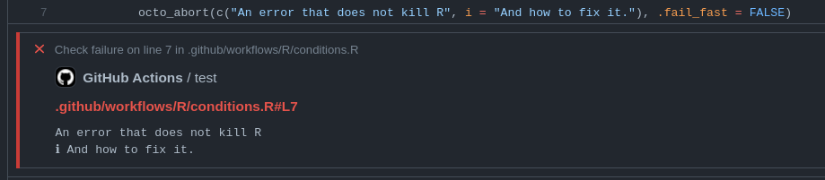

<!-- README.md is generated from README.Rmd. Please edit that file -->

# octolog

<!-- badges: start -->
[](https://www.repostatus.org/#active)
[](https://github.com/assignUser/octolog/actions)
[](https://github.com/assignUser/octolog/actions/workflows/pkgcheck.yaml)
[](https://coveralls.io/github/assignUser/octolog?branch=main)
[](https://zenodo.org/badge/latestdoi/451156961)
<!-- badges: end -->

Octolog provides a complete[^1] API for GitHub [workflow commands](https://docs.github.com/en/actions/using-workflows/workflow-commands-for-github-actions) that makes it easy to create powerful GitHub Actions that create readable logs. 

Additionally it is possible to signal conditions with octolog from R that will create annotations when used within GitHub Actions but raise normal R conditions
when used interactively.


[^1]: The only exception is [`save-state`](https://docs.github.com/en/actions/using-workflows/workflow-commands-for-github-actions#sending-values-to-the-pre-and-post-actions) which can only be used in JavaScript actions. 

## Installation

You can install the development version of octolog with either of these options:

``` r
pak::pak("assignUser/octolog")
devtools::install_github("assignUser/octolog")
```

## What are *GitHub Actions*?
[GitHub Actions](https://github.com/features/actions) is a powerful,free[^2] [CI](https://devguide.ropensci.org/ci.html) service integrated into every repository on GitHub. You can use actions created by other users (e.g. the very popular [r-lib/actions](https://github.com/r-lib/actions) collection of R related actions) or create your own customized workflow that fits your needs.

[^2]: For public repositories.

## Example

The best way to see how {octolog} works, is in an actual [workflow](https://github.com/assignUser/octolog/actions/workflows/test-octolog.yaml). For more information please see the [website](assignUser.github.io/octolog) and the [introductory vignette](https://jacob.wujciak.de/octolog/articles/octolog.html).

## Code of Conduct

Please note that the octolog project is released with a [Contributor Code of Conduct](https://jacob.wujciak.de/octolog/CODE_OF_CONDUCT.html). By contributing to this project, you agree to abide by its terms.
