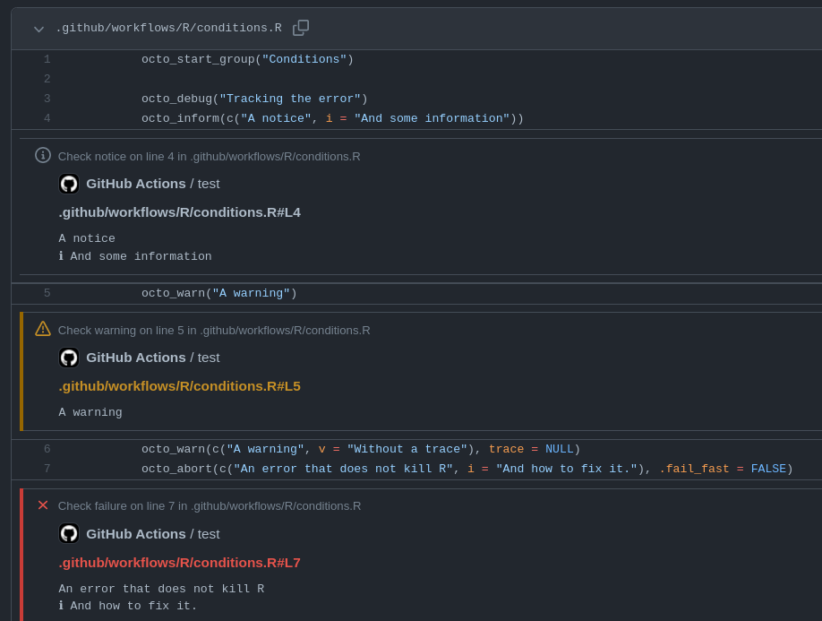
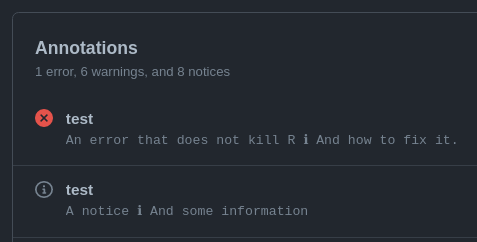
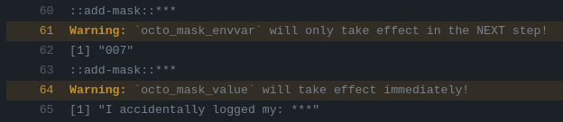

Getting started with octolog is easy, just replace the *{cli}* conditions functions with their octolog counterpart:

* `cli::cli_inform` $\rightarrow$ `octolog::octo_inform`
* `cli::cli_warn` $\rightarrow$ `octolog::octo_warn`
* `cli::cli_abort` $\rightarrow$ `octolog::octo_abort`

In an interactive session you will not see a difference, as the calls are passed through to {cli} but if your code throws conditions within a GitHub Action (detected via the environment variable `GITHUB_ACTIONS = "true"`) the behaviour will change. The conditions will be signaled in a way that will make them stand out in the log, appear in the action summary and create annotations[^1] on affected files. 

You can throw *errors* that do not kill the R session when using `octo_abort()` by setting the optional argument `.fail_fast = FALSE`. This can be useful if you want a workflow to fail (e.g. to block a PR) by throwing an error but do not want to stop the R process.

[^1]: Annotations only work on pull requests.

## Workflow commands

In addition to signaling conditions, GitHub Actions provide a number of [workflow commands](https://docs.github.com/en/actions/using-workflows/workflow-commands-for-github-actions) to interact with the runner and following actions steps. Octolog provides a complete API[^2] for the workflow commands, please see the [function reference](https://jacob.wujciak.de/octolog/reference/index.html) and the official documentation for an overview. To see the workflow commands in practice you can check out the [example workflow](https://github.com/assignUser/octolog/actions/workflows/test-octolog.yaml) or the real world use case of the [pkgcheck action](https://github.com/ropensci-review-tools/pkgcheck-action).

[^2]: The only exception is [`save-state`](https://docs.github.com/en/actions/using-workflows/workflow-commands-for-github-actions#sending-values-to-the-pre-and-post-actions) which can only be used in JavaScript actions. 

## Security

**In doubt always refer to the [official documentation](https://docs.github.com/en/actions/using-workflows/workflow-commands-for-github-actions) and [security hardening guide](https://docs.github.com/en/actions/security-guides/security-hardening-for-github-actions) and test the behaviour to make sure the functions behave as you expect!**

There are commands that can have an impact on the security of your repository if they are not or wrongly used. As their official documentation is a bit lacking in parts this section will add some additional remarks.

### Masking

Masking values directly (`octo_mask_value`) and masking environment variables and their values (`octo_mask_envvar`) differs in unexpected and undocumented ways.

Values masked with `octo_mask_value` will be replaced with "\*\*\*"" immediately but environment variables will only be masked in the ***next*** `step:` of the action!

### Stopping command parsing

If you have to log untrusted user input (like commit messages, issue titles ...) you can prevent the execution of workflow commands using `octo_stop_commands`.Internally the function creates a token based on cryptographically secure random bytes from {openssl}, this makes it impossible for a third party to guess the token before submitting their changes (e.g. to a PR) to enable the execution of their untrusted commands. This is not intended to protect against other R code. Due to R's metaprogramming capabilities it is not possible to protect the token within the same R session.

***NEVER*** run untrusted code using an action trigger that gives write access to your repository like "pull_request_target". See this article about [*pwn requests*](https://securitylab.github.com/research/github-actions-preventing-pwn-requests/) for more in-depth information.

